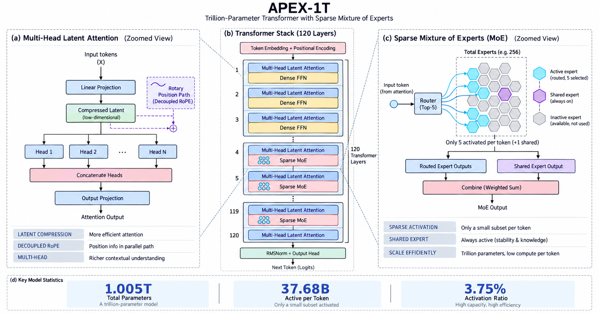
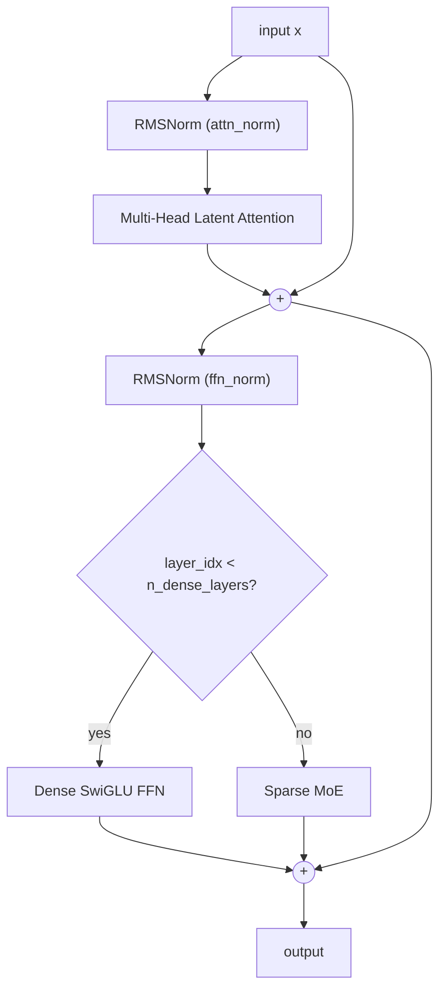
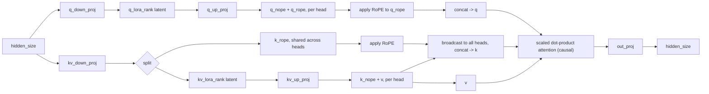
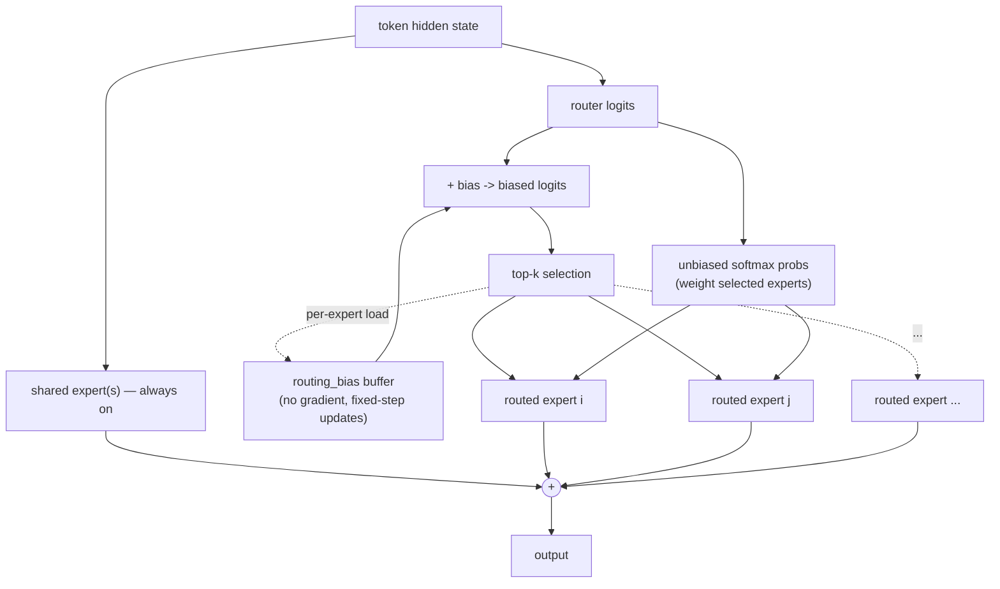

# Apex-1T

A from-scratch PyTorch implementation of a DeepSeek-V3-style architecture — **Multi-Head
Latent Attention (MLA)** with full decoupled RoPE, combined with **auxiliary-loss-free
sparse Mixture-of-Experts (MoE)** — defined at trillion-parameter scale and structurally
validated, but **not trained**.



> **This model has not been trained.** Everything below describes an architecture that is
> implemented, runnable at debug scale, and structurally validated at full (~1T) scale —
> not a trained checkpoint. See [What "validated" means](#what-validated-means-and-doesnt)
> for exactly what that claim covers.

## Why this architecture

Building a dense trillion-parameter transformer is straightforward but not something
anyone would actually deploy — the compute cost of running every parameter on every
token doesn't scale. Real frontier-class models at this size (DeepSeek-V3 being the most
thoroughly documented public example) reach trillion-parameter *capacity* while keeping
per-token *compute* an order of magnitude smaller, through sparsity. Apex-1T's design
choices all follow directly from that idea, and are deliberately modeled on
DeepSeek-V3's published architecture rather than invented from scratch — that grounding
is itself the point: every number and mechanism here has a real, citable reference.

### Multi-Head Latent Attention (MLA) with decoupled RoPE

Standard multi-head attention caches a full-size key and value vector per head per
token — expensive at long context lengths. MLA instead down-projects queries and
keys/values into a shared low-rank latent space before expanding them back out per head,
so far less needs to be cached per token.

The complication: rotary position embeddings (RoPE) are position-*relative*, so they
don't commute cleanly with a compressed latent representation the way they do with plain
per-head keys. DeepSeek-V3's answer — implemented here in full — is to *decouple*
positional information from the compressed content path entirely:

- **Queries** get a small per-head rotary component, produced by the same up-projection
  as the content component, so each head still gets head-specific positional
  information.
- **Keys** get a single rotary component *shared across every head*, produced directly
  by the down-projection rather than per head — this is what keeps the compressed cache
  cheap: only `kv_lora_rank + qk_rope_head_dim` values need to be kept per token, not a
  full per-head key.

This is the most technically intricate part of the codebase — see
[apex1t/attention.py](apex1t/attention.py) — and the part most worth reading if you want
to see the mechanism, not just the headline number.

### Sparse Mixture-of-Experts with a shared expert

Total parameter count and per-token compute are decoupled by routing each token through
only a handful of "expert" feed-forward networks out of many, rather than one large
dense feed-forward network. Apex-1T follows DeepSeek-V3's specific split: one always-on
**shared expert** captures general, broadly-useful knowledge every token needs, while
`top_k` **routed experts**, selected per token from a much larger pool, capture
specialized knowledge. This is why total parameters (all experts that exist) and active
parameters (the ones a given token actually computes through) diverge so sharply — see
the [parameter breakdown](#parameter--flop-breakdown) below.

### Auxiliary-loss-free, bias-based load balancing

A router that's free to send every token to its favorite expert will collapse onto a
handful of experts, starving the rest. The classic fix (Switch Transformer-style) adds
an auxiliary loss term that penalizes imbalance — but that loss term competes with the
main language-modeling objective during training, and DeepSeek-V3's ablations found it
measurably hurts model quality. Instead, Apex-1T implements their alternative: a
per-expert bias, *not* a gradient parameter, added to routing scores purely to steer
which experts get selected. After each forward pass, it's nudged by a small fixed step —
down for experts that were overloaded, up for experts that were underloaded — with zero
effect on the training loss. See [apex1t/moe.py](apex1t/moe.py).

### Dense stem layers

The first `n_dense_layers` (3 in `FullConfig`) transformer blocks use a plain dense
feed-forward network instead of MoE. This mirrors DeepSeek-V3's `first_k_dense_replace`
design: early layers build up stable low-level representations before the added
complexity of routing is introduced, improving training stability in the real model this
is modeled on.

### Scale targets

| | Value | Rationale |
|---|---|---|
| Total parameters | ~1.005T | The headline scale target |
| Active parameters / token | ~37.68B (~3.75%) | Matches DeepSeek-V3's real activation ratio — the sparsity ratio is the entire point, not an arbitrary number |
| Layers | 120 (3 dense + 117 MoE) | DeepSeek-V3-scaled (~61 layers) to roughly double depth while re-solving hidden size/expert count to hold the active-parameter target |
| Vocabulary | 128,000 | Current (2025/2026) frontier default |
| Max context length | 128,000 | Current (2025/2026) frontier default, supported structurally via RoPE (see [validation](#what-validated-means-and-doesnt)) |

## Parameter & FLOP breakdown

These numbers come directly from `apex1t.param_counter`, an analytical function of the
config only, cross-checked exactly (not approximately — down to the integer) against the
real, instantiated module tree by [apex1t/validate.py](apex1t/validate.py). Reproduce
with `python -m apex1t.param_counter`.

### DebugConfig — runs in real memory on this machine

| component | total | active |
|---|---:|---:|
| embedding | 768.00K | 768.00K |
| output_head | 768.00K | 768.00K |
| norms | 4.99K | 4.99K |
| attention | 847.87K | 847.87K |
| dense_ffn | 1.77M | 1.77M |
| router | 24.58K | 24.58K |
| shared_experts | 1.77M | 1.77M |
| routed_experts | 28.31M | 3.54M |
| **TOTAL** | **34.26M** | **9.49M** |

Activation ratio: 27.70% · FLOPs/token (forward, approx): 18.98M

### FullConfig — the ~1T-parameter target, meta-device only

| component | total | active |
|---|---:|---:|
| embedding | 786.43M | 786.43M |
| output_head | 786.43M | 786.43M |
| norms | 1.48M | 1.48M |
| attention | 8.54B | 8.54B |
| dense_ffn | 905.97M | 905.97M |
| router | 161.02M | 161.02M |
| shared_experts | 4.42B | 4.42B |
| routed_experts | 989.32B | 22.08B |
| **TOTAL** | **1004.92B** | **37.68B** |

Activation ratio: 3.75% · FLOPs/token (forward, approx): 75.36B

*FLOPs/token uses the standard forward-pass approximation `2 × active_params`, which
ignores the smaller, sequence-length-dependent attention-score term — negligible next to
the projection cost at this parameter count. See the docstring in
[apex1t/param_counter.py](apex1t/param_counter.py) for the full accounting conventions
(what counts as "active", why embedding/output head are always-active, etc).*

## Architecture diagrams

The overview diagram above covers the full picture — MLA's compression flow, the
120-layer stack with the dense-to-sparse transition, and MoE routing. The Mermaid
diagrams below break each piece down further, generated directly from the code.

### Transformer block

Pre-norm residual block. The FFN sublayer is either a plain dense SwiGLU network (for
the first `n_dense_layers`) or the sparse MoE layer, chosen by `layer_idx` at
construction time — see [apex1t/block.py](apex1t/block.py).



### MLA data flow



### MoE routing flow



## What "validated" means (and doesn't)

Apex-1T is **not trained**. What is actually verified, by
[apex1t/validate.py](apex1t/validate.py) and the pytest suite:

1. **`DebugConfig` (~34M params) runs for real.** A real forward pass and a real
   backward pass execute in-memory on ordinary hardware, gradients reach every parameter
   expected to receive one (attention projections, shared expert, every selected routed
   expert, router weights), and the MoE load-balancing bias buffer measurably updates.
   This proves the architecture's math is correct, not just its shapes.
2. **`FullConfig` (~1T params) constructs correctly at real scale.** It's instantiated
   on PyTorch's `meta` device — so zero real memory is allocated — and the module graph
   builds with no shape errors across all 120 layers.
3. **The analytical parameter counter is exactly right, not approximately right.** The
   pure-function counter in `apex1t/param_counter.py` is cross-checked against
   `sum(p.numel() for p in model.parameters())` on both the real `DebugConfig` model and
   the meta-instantiated `FullConfig` model — an *exact* integer match in both cases, not
   an estimate. That's what makes the "~1.005T total / ~37.68B active" numbers above a
   verified claim rather than a hand-wave.
4. **RoPE's positional encoding isn't hardcoded to a short context.** The rotary cos/sin
   cache is built directly at the full 128K context length as a structural check,
   without requiring the O(seq_len²) attention memory a full 128K forward pass would
   need (which this machine doesn't have).

What is **not** claimed: that the full 1T-parameter model runs a forward pass in real
memory, or that any version of the model has learned anything from data.

## Reproducing the validation

```bash
# install (Python 3.10+, uses PyTorch)
uv venv --python 3.12
uv pip install -e ".[dev]"

# run the full pytest suite
.venv/bin/python -m pytest

# run the validation suite directly, with a clear pass/fail report
.venv/bin/python -m apex1t.validate

# print the parameter/FLOP breakdown table for both configs
.venv/bin/python -m apex1t.param_counter
```

## Project layout

| Module | Contents |
|---|---|
| [apex1t/config.py](apex1t/config.py) | `ModelConfig` schema, `DEBUG_CONFIG`, `FULL_CONFIG` |
| [apex1t/param_counter.py](apex1t/param_counter.py) | Analytical parameter/FLOP counter |
| [apex1t/attention.py](apex1t/attention.py) | Multi-Head Latent Attention + decoupled RoPE |
| [apex1t/ffn.py](apex1t/ffn.py) | Shared SwiGLU feed-forward block |
| [apex1t/moe.py](apex1t/moe.py) | Sparse MoE with bias-based load balancing |
| [apex1t/norm.py](apex1t/norm.py) | RMSNorm |
| [apex1t/block.py](apex1t/block.py) | Transformer block (attention + dense/MoE FFN) |
| [apex1t/model.py](apex1t/model.py) | End-to-end `Apex1T` model |
| [apex1t/validate.py](apex1t/validate.py) | The validation suite described above |

## License

MIT — see [LICENSE](LICENSE).
